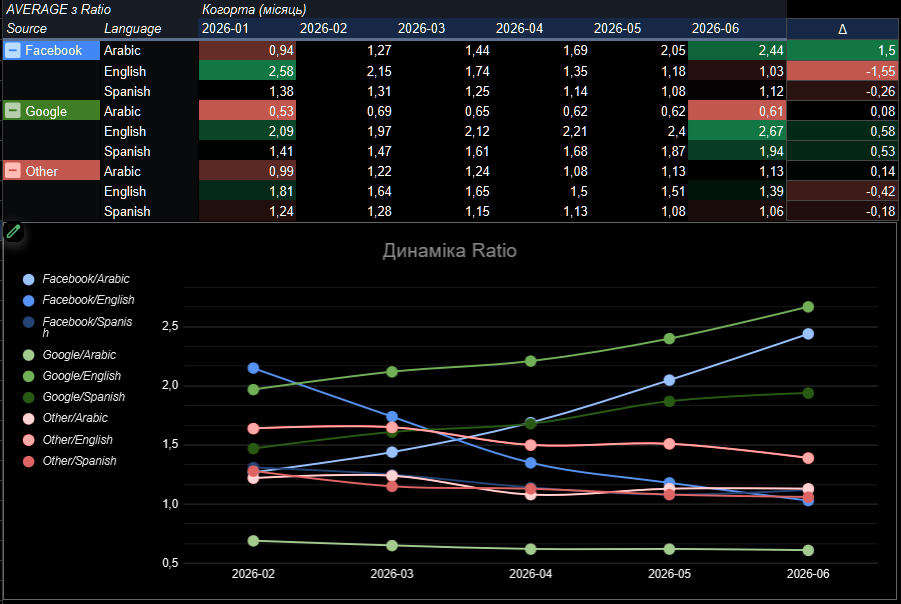

# google-sheets-analytics-1
A collection of 3 comprehensive business intelligence and product analytics cases in Google Sheets. Covers product performance metrics, strategic goal tracking, and commercial data modeling. Features automated dashboards built using complex lookups, dynamic filtering, and custom visualization frameworks.
> 💡 **How to review:** > You can either click the links below in this file to view in Google Sheets, or open the attached pdf files.
# 🔵 Tasks
### **🔹 Case 1: Unit Economics & Paid Acquisition Scaling (Marketing Intelligence)**

- **Context:** Operating as a Product Analyst for a subscription-based mobile application. The marketing team drives new subscriber traffic through various acquisition channels and language-based geographies. The dataset contains 6 closed monthly cohorts (January–June 2026), where each record represents a specific slice: _Acquisition Channel × Language Geolocation × Activation Month_.
- **Business Objective:** The marketing department is prepared to reallocate the advertising budget. The task is to identify and justify the **Top 3 high-performing user segments** that should be scaled immediately to maximize return on investment.

### **🔹 Case 2: Product Retention & Onboarding Optimization (EdTech/Gaming)**

- **Context:** Analyzing an educational gaming application tailored for children. During the onboarding flow, parents select a primary developmental goal for their child: _Speech, Reading, or Motor Skills_. The platform hosts 10 games—some active since early 2026, while others were released sequentially at a rate of approximately one new game per month. The analysis is based on weekly operational data spanning January–June 2026 across multiple data sheets.
- **Business Objective:** To design and implement an automated recommendation engine that suggests the single best-retaining game for each user profile. The goal is to determine **which specific game should be recommended for EACH developmental goal** (_Speech, Reading, and Motor_) based on long-term user retention curves.

### **🔹 Case 3: Monetization Architecture & Paywall A/B Testing**

- **Context:** The product team deployed a major structural update to the application's paywall strategy.
    - _Legacy Paywall:_ Featured 3 tiers (Weekly Trial at $10/week, Weekly Non-trial at $8/week, and a 6-Month subscription at $40).
    - _New Paywall:_ Shifted to a 3-tier value-based pricing structure (Weekly Trial at $8/week, Yearly at $29.99, and a Lifetime unlock at $39.99).
- The user acquisition team confirms that traffic volume, quality, and acquisition costs (CAC) remained identical across testing periods. The performance evaluation is based on two distinct user cohorts with a closed 12-month lifetime (+1 month operational buffer, resulting in 13 months of observation data).
- **Business Objective:** Evaluate and contrast the monetization efficiency of the legacy versus the new paywall architecture. The core objective is to deliver a data-backed verdict on **which paywall architecture monetizes better and explain the underlying financial drivers**.

# 💊 Solution
### **🔸 Case 1**
🔗[Case1_Analysis](https://docs.google.com/spreadsheets/d/1AsdD-VSFxcaEIKJax-SsaWnrhSkeIyWGJWtA3pVvuSE/edit?usp=sharing)

- **Top 3 Segments to Scale:** Focus on the latest available month (June) combined with positive dynamics rather than using a static 6-month average.
    - **Google × English:** Peak economics. June performance reaches $\\approx 2.67x$ and shows clear growth ($\\text{Jan: } 2.09 \\rightarrow \\text{Jun: } 2.67$).
    - **Facebook × Arabic:** Late-stage breakout performance. Surged from $0.94$ in January to $2.44$ in June, representing the fastest scaling velocity in the dataset.
    - **Google × Spanish:** Consistent upward trend, climbing from $1.41$ in January to $1.94$ in June.

- **Trap #1 — Single-Facet Analysis (Source-Only Blending):** > **The Illusion:** Looking strictly at the acquisition source shows Facebook blended at $\\approx 1.42$, which superficially outperforms Google's break-even blend of $\\approx 1.05$.  
    _Naivety:_ A surface-level conclusion suggests "scale Facebook, cut Google." However, 2 out of the top 3 individual performing segments are hidden directly inside Google.
- **Trap #2 — Single-Facet Analysis (Language-Only Blending):  
    The Illusion:** Evaluating solely by geography shows English blended at a top-tier $\\approx 1.65$, while Arabic appears entirely non-viable at a sub-critical $\\approx 0.76$.  
    _Naivety:_ A surface-level conclusion dictates "kill Arabic traffic." Yet, Facebook × Arabic stands as the second-best scaling segment in the entire portfolio.
- **The Double Trap:** Both one-dimensional facet cuts incorrectly signal to kill Google and Arabic. This is where the most lucrative sub-segments live; relying on single-facet views leads to highly destructive budget allocation.
- **Trap #3 — Blended Averages vs. Real-Time Dynamics:** Facebook × English appears dominant on a 6-month aggregate view (pooled: $1.50$, simple average: $1.67$), even leading the baseline ranking. However, its performance is in active collapse ($\\text{Jan: } 2.58 \\rightarrow \\text{Jun: } 1.03$). Scaling based on historical averages injects capital into a dying funnel while missing accelerating opportunities.
- **Why Blends Deceive (Volume Weighting Bias):** Google × Arabic commands $\\approx 69\\%$ of the entire Google ad spend but operates at a failing $\\approx 0.61x$ return (driven by a low $\\$15$ LTV from low-quality traffic despite standard CAC). This heavy volume drags down the entire Google-blended performance, masking the high returns of Google × English and Google × Spanish. Symmetrically, Google × Arabic represents $\\approx 81\\%$ of total Arabic spend, causing the entire language cut to look dead.

### **🔸 Case 2**
🔗[Case2_Analysis](https://docs.google.com/spreadsheets/d/1HQwTLh3tgBxgRFRbbnBShTUaObutD7G1MQ146ME8c6M/edit?usp=sharing)

- **Targeted Game Recommendations:** Determined using a weighted $W2$ retention metric on a synchronized data horizon.
    - **Speech $\\rightarrow$ ChatterChimps:** $36\\%$ retention (New game; launched at $W05$ across 20 active cohorts. Legacy benchmark _MrMumbles_ underperforms at $27.5\\%$).
    - **Reading $\\rightarrow$ StoryForest:** $38\\%$ retention (New game; launched at $W09$ across 16 active cohorts. Legacy benchmark _LetterLlama_ underperforms at $28.0\\%$).
    - **Motor $\\rightarrow$ WiggleWorms:** $33\\%$ retention (New game; launched at $W14$ across 11 active cohorts. Legacy benchmark _TapTapZoo_ underperforms at $22.1\\%$).
- **Core Insight:** All three top-performing recommendations are newly released titles despite their shorter operational data curves. The runner-up across all categories is also a new title (_DoodleDragons_). Legacy core games fail on baseline retention despite maintaining historical volume dominance.
- **Trap #1 — WAU vs. Cohort Retention:** Ranking purely by Weekly Active Users (WAU) defaults back to legacy legacy titles (_Speech $\\rightarrow$ MrMumbles, Reading LetterLlama, Motor $\\rightarrow$ TapTapZoo_). High WAU figures here are artifacts of historical acquisition volume and 6 months of accumulated user base, not active product stickiness. The true retention winners remain mid-tier by absolute WAU.
- **Trap #2 — Incomplete Curves & Mixed Horizons:** Evaluating via a naive "average retention across all active weeks" falsely crowns _GalaxyGigglers_ ($\\approx 45\\text{--}47\\%$). This title launched late on $W25$ and contains exactly 1 cohort with a single week ($W1$) of data. Because $W1$ is always artificially high, older games are penalized by lower late-week retention data, while _GalaxyGigglers_ shows an inflated average. The solution requires fixing the evaluation horizon at $W2$, where active contenders have mature, statistically sound data. _EchoOwls_ (3 cohorts) and _GalaxyGigglers_ (0 cohorts at $W2$) lack sufficient data density to be safely recommended.  
    _Note: $W4$ data drops significantly in volume for younger games, validating the operational anchor at $W2$._
- **Trap #3 — The Generalization Blindspot:** Applying a global, unsegmented $W2$ weighted average crowns _StoryForest_ ($\\approx 31.6\\%$) as the universal recommendation across all verticals. However, _StoryForest_ underperforms in alternative segments: Speech favors _ChatterChimps_ ($38\\%$ vs. $23\\%$) and Motor favors _WiggleWorms_ ($37\\%$ vs. $21\\%$). A single generic product deployment fails to optimize 2 out of the 3 user intents.

### **🔸 Case 3**
🔗[Case3_Analysis](https://docs.google.com/spreadsheets/d/1nnnhAHXJne0ozy6qOyCa0F8m3QFq6qoA4nwHjIyoyp8/edit?usp=sharing)

- **Core Performance Verdict:** The new paywall configuration delivers superior overall monetization performance, generating an ARPU of **$\\$1.8$** compared to the legacy paywall's **$\\$1.6$** ($+11.8\\%$ net expansion).
- **Trap #1 — The ARPPU Deception:** The blended ARPPU (Average Revenue Per Paying User) of the new paywall architecture is structurally lower than the legacy framework: **$\\$59.28$** vs. **$\\$67.54$**. Stopping analysis at this metric yields the false conclusion that the new paywall underperforms.
- **The Underlying Value Driver:** The conversion rate ($CR$) into the cheaper $\\$8$ Weekly Trial optimized significantly, hitting **$2.75\\%$** compared to the legacy $\\$10$ Weekly Trial at **$1.50\\%$** (a $1.83x$ scaling factor). This conversion surge fully compensates for the lower average order value of the cohort.

$$\\text{ARPU} = \\text{CR} \\times \\text{ARPPU}$$

The scaling factor of the conversion rate completely overrides the compression in ARPPU.

- **The Structural Core Trap:** Evaluating monetization health strictly through ARPPU introduces systematic bias by omitting non-converting users. ARPPU evaluates paying users only; ARPU evaluates monetization across every single install by balancing conversion rate with cash generation.
- **Volume Variance Risk:** The legacy cohort contains $129,000$ installs, whereas the new paywall cohort captures only $76,000$ installs ($1.7x$ smaller footprint). This introduces a risk vector: the new paywall registers higher efficiency but on a compressed traffic volume. Before rolling out the change globally, it is essential to validate whether these conversion metrics hold up under full acquisition volumes or if they are influenced by small-number selection bias.
